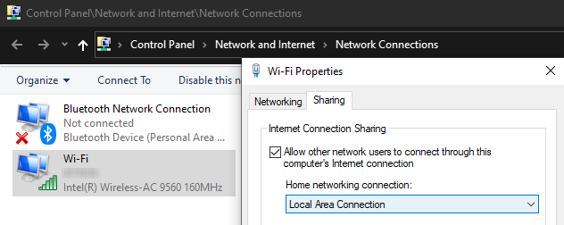

# RasPi-SimpleMusicPlayer
 A very simple music player to satisfy a very simple request

## Setup
### Requirements
- Raspberry Pi
- MicroSD card
- MicroUSB power source
- AUX-Coord & Speaker
- Desktop or Laptop
- Ethernet Cable

### Initial
- Flash a MicroSD card with [Raspberry Pi Imager](https://www.raspberrypi.org/software/) (or preferred method)
- Add an empty file to the Boot partition named `SSH`
- Insert MicroSD
- Connect power to Pi

### SSH
- Connect Ethernet cable to Pi and Desktop
- Connect to Pi with `ssh pi@raspberrypi.local` (Terminal, Powershell, PuTTY)
  - If prompted, trust domain
  - Password is `raspberry`
#### Connect to Internet
There are multiple ways to achieve this:
- Activate Wi-Fi sharing through Ethernet
  - For Windows, search `view network connections`, right-click **Wi-Fi**, click **Properties**, open **Sharing** tab.
   
  Activate **Allow other network users...** and set **Home networking connection** to `Local Area Connection`.
  
- Connect Raspberry Pi to Wi-Fi
  - Within SSH, run `sudo raspi-config`
  - **System Options**, **Network Options**, **Wireless LAN**
  - **SSID** is the router's name, as it would appear on other devices
  - Provide **Password** if applicable

### Start on Boot
- Use [crontab](https://www.raspberrypi.org/documentation/linux/usage/cron.md)
- `@reboot`

TODO: Populate!